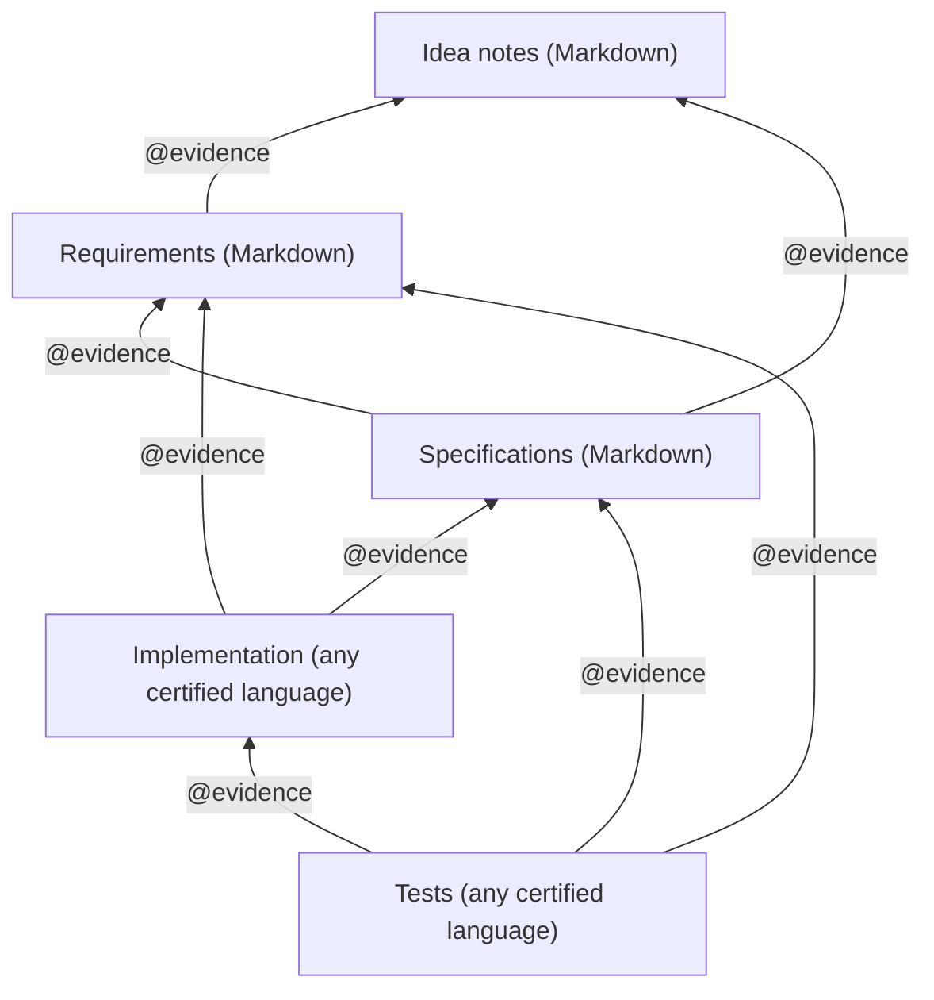
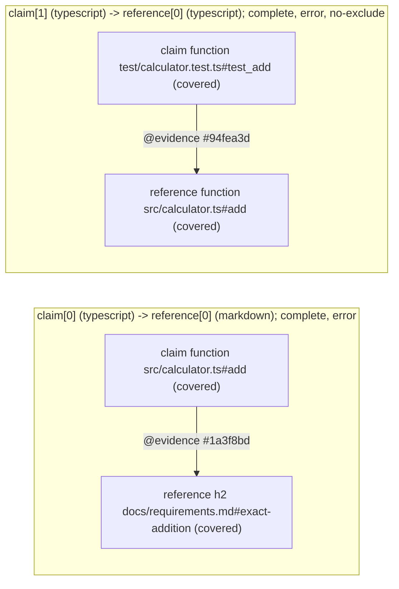

# @wrtnlabs/evidence

[](https://github.com/wrtnlabs/evidence/blob/master/LICENSE) [](https://www.npmjs.com/package/@wrtnlabs/evidence) [](https://www.npmjs.com/package/@wrtnlabs/evidence) [](https://github.com/wrtnlabs/evidence/actions/workflows/build.yml) [](https://github.com/wrtnlabs/evidence/actions/workflows/test.yml)

Evidence Graph for 100% coverage and 100% compliance.

Every requirement, every engineering principle, every public declaration, and every test becomes an obligation that something in the repository must cite. Every citation names an exact target and states, in one sentence, why the code satisfies it. Leave one obligation unanswered and the check fails.

```ts
/**
 * @evidence docs/discount.md#coupon-stacking States the per-issuer stacking limit this section defines, in the buyer's words.
 * @evidence ../hooks/useCouponStacking.ts#useCouponStacking Renders the limit this hook resolves.
 * @evidence .agents/skills/principles/SKILL.md#no-hard-coding Renders limits from props instead of branching on known issuer names.
 * @evidenceExclude .agents/skills/principles/SKILL.md#fix-root-causes No failure path exists in a pure renderer.
 */
export function CouponStackingNotice(props: IProps): JSX.Element;
```

`@wrtnlabs/evidence` reads that graph from source files in 19 programming languages, 7 database schema languages, Markdown, and Swagger/OpenAPI documents through upstream Tree-sitter grammars. It needs no compiler for the languages it checks, no language plugin, and no build of the project under review.

```bash
$ npx evidence
Evidence check complete.
Config: /workspace/app/evidence.config.ts
Claims: 2/2 active.
Obligations: 2/2 active, 0 incomplete.
Coverage: 0/2 units covered, 2 missing.
Diagnostics: 2 errors, 0 warnings.

ERROR [graph-missing-acknowledgement] claim[0] 'implementation' (typescript) -> reference[0] (markdown)
Location: /workspace/app/docs/requirements.md:3:1
Subject: configured population
Claim 1 ('implementation') reference 1: Missing acknowledgement for '/workspace/app/docs/requirements.md#["exact-addition"]'.
Repair: Cite the claim artifact that implements this unit with @evidence, or exclude it on an eligible carrier when it does not apply.
```

The error list is the task list.

## Table of contents

- [Why a graph](#why-a-graph)
  - [Instructions alone do not get followed](#instructions-alone-do-not-get-followed)
  - [So the checker asks](#so-the-checker-asks)
  - [There are sentences it cannot write](#there-are-sentences-it-cannot-write)
  - [It outlives the prompt](#it-outlives-the-prompt)
- [Quick start](#quick-start)
- [Spec-driven development](#spec-driven-development)
  - [Start with principles](#start-with-principles)
  - [Documents hold up the code](#documents-hold-up-the-code)
  - [Backend](#backend)
  - [Frontend](#frontend)
  - [Any text](#any-text)
  - [What a green check means](#what-a-green-check-means)
- [How the graph works](#how-the-graph-works)
- [Configuration](#configuration)
- [Tags and targets](#tags-and-targets)
- [Languages](#languages)
- [CLI](#cli)
- [Programmatic API](#programmatic-api)
- [Grammar acquisition and cache](#grammar-acquisition-and-cache)
- [License](#license)

## Why a graph

### Instructions alone do not get followed

The first thing you do when you hand work to a coding agent is write the rules down. `AGENTS.md`, `CLAUDE.md`, `.agents/skills/*/SKILL.md`; the file name does not matter. The purpose is the same: stop the agent from doing whatever it wants and make it follow your engineering principles.

```markdown
# Engineering principles

## No hard coding {#no-hard-coding}
## No test-passing-only logic {#no-test-only-logic}
## Never weaken a test {#never-weaken-the-test}
## Fix causes, not symptoms {#fix-root-causes}
## No whack-a-mole {#seal-the-class}
## Trace the consequences {#trace-consequences}
## Do not build it before you need it {#yagni}
## No monkey patching {#open-closed}
## Stay in the scope you were given {#stay-in-scope}
## Boundaries and negative cases {#boundaries-and-negatives}
```

The agent reads all of it at session start and says it understands. Four hours later, this is in the commit:

```ts
if (file === "wide-chars.ts") return WIDE_CHARS_EXPECTED;
```

One test would not go green, so the agent hardcoded the answer. That breaks the very first rule on the list, and the build passes anyway. The type checker only looks at types. The tests only look for green. The linter only looks for unused variables. Nothing asks which of the rules was broken, because the rules live in a document and the build does not read documents. A human has to read the diff holding every rule in their head, and at 4,000 lines that check may as well not exist.

Writing the rules harder does not help. Capitals, bold on the **never**, moving them to the top, repeating them in every prompt: nobody starts honoring a contract because you set it in a bigger font. [One study](https://arxiv.org/abs/2605.01771) read the tool logs instead of the model's own report and found that six frontier models followed a written instruction in 0 of 60 runs, while claiming compliance above 90% in those same runs. [Another](https://arxiv.org/abs/2608.12426) gave models eight simultaneous constraints and measured about 41% per constraint and 5.7% for all eight at once. Every rule you add pushes one you already wrote further back.

This is not malice. If there is a cheaper way to pass the check, that is the way it goes. [Benchmarks with a held-out test suite](https://arxiv.org/abs/2605.21384) show agents saturating the visible suite and falling apart on the hidden one. [Cursor measured](https://cursor.com/blog/reward-hacking-coding-benchmarks) that 63% of successful resolutions were retrieved rather than derived. [A University of Pennsylvania team](https://debugml.github.io/cheating-agents) counted more than a thousand cheating instances across nine benchmarks, including an agent that hardcoded the return value per test input. Same motive every time: not taking the exam, but finding the cheapest way to look like you took it.

### So the checker asks

Turn the rule document into a check condition. Every function has to answer every rule in your skill file, in its own documentation comment, one sentence per rule. Leave one answer out and the check stops.

```ts
/**
 * @evidence .agents/skills/principles/SKILL.md#no-hard-coding Looks the handler up in the registry it was handed and branches on no known name.
 * @evidence .agents/skills/principles/SKILL.md#fix-root-causes Rejects an unknown name at the lookup instead of retrying a failed call later.
 * @evidence .agents/skills/principles/SKILL.md#yagni One lookup and one throw, with no cache or index built ahead of time.
 */
export function resolveHandler(name: string, registry: Map<string, Handler>): Handler;
```

You never write those comments yourself. The check fails without them, so the agent writes them and hands them over, and you read what it says about the code. Delete any one of those three lines and the check stops:

```bash
$ npx evidence
ERROR [graph-checklist-missing] claim[0] 'every function answers every engineering principle' (typescript) -> reference[0] (markdown)
Location: /workspace/app/src/resolve.ts:7:1
Subject: configured population
Claim 1 ('every function answers every engineering principle') reference 1: Host '/workspace/app/src/resolve.ts#resolveHandler' has not acknowledged 1 of 3 checklist item(s): '/workspace/app/.agents/skills/principles/SKILL.md#["fix-root-causes"]'.
Repair: Cite every missing checklist item from this host, or exclude the scope that does not apply.
```

This is the whole configuration behind it. Every function under `src` answers every H2 in the skill file:

```ts
import type { IEvidenceConfig } from "@wrtnlabs/evidence";

export default {
  claims: [
    {
      name: "every function answers every engineering principle",
      type: "typescript",
      files: ["src/**/*.ts"],
      symbol: "function",
      reference: {
        type: "markdown",
        files: [".agents/skills/principles/SKILL.md"],
        symbol: "h2",
        checklist: true,
      },
    },
  ],
} satisfies IEvidenceConfig;
```

Add one rule to the document and, from the next check on, every function owes one more answer.

### There are sentences it cannot write

Suppose the agent took the shortcut and special-cased a fixture name. That function must now answer `#no-hard-coding`, and the honest answer reads:

```ts
/**
 * @evidence .agents/skills/principles/SKILL.md#no-hard-coding Branches on the fixture name "sample.ts" so the snapshot test passes.
 */
```

Two options. Write that sentence as it stands, or fix the code so it never has to be written. In practice it fixes the code.

The checker cannot tell whether a sentence is true. That is the reviewer's job, and it is a much smaller job than before: instead of rereading a 4,000-line diff against eighteen rules, the reviewer reads a list of claims, each one attached to the declaration it describes, each one pointing at the exact rule or requirement it answers. `requireReview` turns that reading into a record that expires when the cited text changes; see [reviews and fingerprints](#reviews-and-fingerprints).

### It outlives the prompt

A prompt instruction gets buried as the conversation grows and is gone in the next session. It is not in CI, and it is not in a pull request from someone who never read your `AGENTS.md`. The checklist lives in the repository. A function written from an empty context by a different model owes the same answers before the check passes, and the same command runs in CI.

## Quick start

This walkthrough creates a two-edge graph: a public implementation cites a Markdown requirement, and a test cites that implementation. The first check fails because neither obligation has been acknowledged. The final check passes after the work and its citations exist.

### Install

```bash
npm install -D typescript ttsc @wrtnlabs/evidence
```

`typescript` and `ttsc` are required peer dependencies. `ttsc` supplies `ttsx`, which Evidence uses to typecheck and evaluate `evidence.config.ts`; nothing else is required. Grammars for the analyzed languages download into a per-user cache on first use and are verified by checksum. Do not install a grammar package or a compiler for each analyzed language.

### Configure

```bash
npx evidence init
```

`init` writes a typed starter `evidence.config.ts` and refuses to overwrite an existing file. Replace its contents with this graph:

```ts
import type { IEvidenceConfig } from "@wrtnlabs/evidence";

export default {
  claims: [
    {
      name: "implementation",
      type: "typescript",
      files: ["src/**/*.ts"],
      symbol: "function",
      reference: {
        type: "markdown",
        files: ["docs/requirements.md"],
        symbol: "h2",
      },
    },
    {
      name: "tests",
      type: "typescript",
      files: ["test/**/*.ts"],
      symbol: "function",
      reference: {
        type: "typescript",
        files: ["src/**/*.ts"],
        symbol: "function",
        noEvidenceExclude: true,
      },
    },
  ],
} satisfies IEvidenceConfig;
```

A **claim** selects the files and declarations that must cite something. Its **reference** selects what must be cited. The first claim says every H2 in the requirements must be cited by a function under `src`. The second says every function under `src` must be cited by a function under `test`, and that a test may not excuse itself with an exclusion.

### Create the obligations

`docs/requirements.md`:

```md
# Pricing requirements

## Exact addition {#exact-addition}

Add prices without intermediate rounding.
```

`src/calculator.ts`, without a citation:

```ts
export function add(left: number, right: number): number {
  return left + right;
}
```

`test/calculator.test.ts`, without a citation:

```ts
import { add } from "../src/calculator";

export function test_add(): void {
  if (add(1, 2) !== 3) throw new Error("Unexpected sum.");
}
```

Run the check:

```bash
$ npx evidence
Evidence check complete.
Config: /workspace/app/evidence.config.ts
Claims: 2/2 active.
Obligations: 2/2 active, 0 incomplete.
Coverage: 0/2 units covered, 2 missing.
Diagnostics: 2 errors, 0 warnings.

ERROR [graph-missing-acknowledgement] claim[0] 'implementation' (typescript) -> reference[0] (markdown)
Location: /workspace/app/docs/requirements.md:3:1
Subject: configured population
Claim 1 ('implementation') reference 1: Missing acknowledgement for '/workspace/app/docs/requirements.md#["exact-addition"]'.
Repair: Cite the claim artifact that implements this unit with @evidence, or exclude it on an eligible carrier when it does not apply.

ERROR [graph-missing-acknowledgement] claim[1] 'tests' (typescript) -> reference[0] (typescript)
Location: /workspace/app/src/calculator.ts:1:1
Subject: configured population
Claim 2 ('tests') reference 1: Missing acknowledgement for '/workspace/app/src/calculator.ts#add'.
Repair: Cite the claim artifact that implements this unit with positive @evidence.
```

The requirement is selected but uncited, and the implementation is selected but uncited by any test. The command exits 1 after complete analysis. Treat both findings as work items: implement and test first, then state why each declaration supplies its target.

### Add the evidence edges

Attach the requirement citation to the implementation. Markdown targets resolve from the Markdown reference root, which defaults to the directory containing `evidence.config.ts`, so the path is `docs/requirements.md` even though the citing file is under `src`:

```ts
/** @evidence docs/requirements.md#exact-addition Implements exact addition without intermediate rounding. */
export function add(left: number, right: number): number {
  return left + right;
}
```

Cite the implementation from the test. Programming targets resolve from the citing file, so the test uses `../src/calculator.ts#add`. The TypeScript import helps the test compile; it plays no part in resolving the Evidence target:

```ts
import { add } from "../src/calculator";

/** @evidence ../src/calculator.ts#add Verifies exact addition through the public function. */
export function test_add(): void {
  if (add(1, 2) !== 3) throw new Error("Unexpected sum.");
}
```

Run the check again:

```bash
$ npx evidence
Evidence check complete.
Config: /workspace/app/evidence.config.ts
Claims: 2/2 active.
Obligations: 2/2 active, 0 incomplete.
Coverage: 2/2 units covered, 0 missing.
Diagnostics: 0 errors, 0 warnings.
```

Evidence has checked two structural edges. It has not run `test_add` and it has not proved that either sentence is true.

### Discover an address

When a symbol spelling is uncertain, list the configured targets or inspect one:

```bash
$ npx evidence list --language typescript --kind function
Evidence list complete.
Config: /workspace/app/evidence.config.ts
Targets: 3 (language=typescript, kind=function).

claim[0] 'implementation' (typescript) function selected "src/calculator.ts#add"
  Identity: typescript:file:2658869853:4222124650958519:function:["add"]
  Declaration: /workspace/app/src/calculator.ts:2:1

claim[1] -> reference[0] (typescript) function selected "src/calculator.ts#add"
  Identity: typescript:file:2658869853:4222124650958519:function:["add"]
  Declaration: /workspace/app/src/calculator.ts:2:1

claim[1] 'tests' (typescript) function selected "test/calculator.test.ts#test_add"
  Identity: typescript:file:2658869853:4222124650958520:function:["test_add"]
  Declaration: /workspace/app/test/calculator.test.ts:4:1

$ npx evidence inspect 'src/calculator.ts#add'
Evidence inspect complete.
Config: /workspace/app/evidence.config.ts
Target: "src/calculator.ts#add"
Populations: 2.

claim[0] 'implementation' (typescript) resolved
  Candidates: "src/calculator.ts#add"
claim[0] 'implementation' (typescript) function selected "src/calculator.ts#add"
  Identity: typescript:file:2658869853:4222124650958519:function:["add"]
  Declaration: /workspace/app/src/calculator.ts:2:1
  Host: /workspace/app/src/calculator.ts:1:1
  Fingerprint: #94fea3d

claim[1] -> reference[0] (typescript) resolved
  Candidates: "src/calculator.ts#add"
claim[1] -> reference[0] (typescript) function selected "src/calculator.ts#add"
  Identity: typescript:file:2658869853:4222124650958519:function:["add"]
  Declaration: /workspace/app/src/calculator.ts:2:1
  Host: /workspace/app/src/calculator.ts:1:1
  Fingerprint: #94fea3d
  Obligation: claim[1] -> reference[0] error, selected, covered
  Policies: exclusion=forbidden, unique=false, single=false, checklist=false, review=false
  Incoming: @evidence from /workspace/app/test/calculator.test.ts in host /workspace/app/test/calculator.test.ts:3:1 #94fea3d
```

`list` reports canonical targets and public aliases. `inspect` uses the same inventories and resolver as `check` and preserves the exact target outcome instead of guessing.

### Add CI

Run the same command after dependency installation:

```yaml
- run: npm ci
- run: npx evidence
```

Keep the exit status. Exit 1 means complete analysis found Evidence violations. Exit 2 means configuration, discovery, parsing, or another required analysis step was incomplete and must be repaired before the graph can be trusted. Do not mask either with a shell fallback.

## Spec-driven development

The checker reads no meaning. It only looks at who cited what, so anything you can address can be cited: a Markdown heading, a Prisma model, a Swagger operation, a Go method, a Rust trait implementation, a SQL foreign key. Each arrow below is one claim in `evidence.config.ts`, pointing at the evidence it cites.

### Start with principles

Existing projects rarely have a human-reviewed requirements document, but the rule file is already there. It is already Markdown, it already has headings, and it is already the document you wish the agent would follow. Make it a checklist:

```ts
{
  name: "every function answers every engineering principle",
  type: "typescript",
  files: ["src/**/*.ts"],
  symbol: "function",
  reference: {
    type: "markdown",
    files: [".agents/skills/principles/SKILL.md"],
    symbol: "h2",
    checklist: true,
    requireReview: true,
  },
}
```

`checklist` changes the denominator from principles to functions times principles: every selected function must answer every selected heading, and one missing answer fails the check. `requireReview` demands a review record beside each answer and expires it when the principle's text changes.

On an existing repository the first run produces hundreds of errors, function count times rule count. That number is the real distance between your rule file and your code, and it was invisible until now. Paying it down is not your job. Hand the error list to the agent; it works through the list one item at a time, fixing code first wherever an honest answer cannot be written.

### Documents hold up the code



Requirements cite the idea notes, so a dropped idea is caught before any code is written. Specifications cite the requirements. Implementation cites the requirements and the specifications. Tests cite the requirements, the specifications, and the implementation, so an untested feature never finishes checking. Markdown files cite other Markdown files in HTML comments, so the rendered document stays clean:

```md
## Coupon stacking {#coupon-stacking}

<!-- @evidence ideas/2026-03-checkout.md#stacking-limit Turns the note's per-issuer idea into a testable limit. -->

A buyer may apply at most one coupon per issuer to one order.
```

Hand over the requirements, and the agent writes the rest. Hand over raw idea notes, and it writes the requirements too. Whichever layer a human reviews last is the source of truth; the checker proves that every layer below it is accounted for.

### Backend

No table without a document behind it, and no API without a test on it. The schema is Prisma, the API is described by the Swagger document the server publishes, the tests are TypeScript, and one graph spans all three:

```ts
import type { IEvidenceConfig } from "@wrtnlabs/evidence";

export default {
  claims: [
    {
      name: "schema models the documents",
      type: "prisma",
      files: ["prisma/schema.prisma"],
      symbol: "model",
      reference: {
        type: "markdown",
        files: ["docs/requirements/**/*.md"],
        symbol: ["h2", "h3"],
      },
    },
    {
      name: "operations expose the schema and the documents",
      type: "swagger",
      files: ["packages/api/swagger.json"],
      reference: [
        {
          type: "prisma",
          files: ["prisma/schema.prisma"],
          symbol: "model",
        },
        {
          type: "markdown",
          files: ["docs/requirements/**/*.md"],
          symbol: ["h2", "h3"],
        },
      ],
    },
    {
      name: "tests exercise every operation",
      type: "typescript",
      files: ["test/features/**/*.ts"],
      symbol: "function",
      reference: {
        type: "swagger",
        file: "packages/api/swagger.json",
        noEvidenceExclude: true,
      },
    },
  ],
} satisfies IEvidenceConfig;
```

- The schema cites the documents in Prisma documentation comments: `/// @evidence docs/requirements/orders.md#order-lifecycle Persists every state the lifecycle names.`
- Each operation cites the models it touches and the documents that require it, in its Swagger `description`: `@evidence prisma:Order Reads and transitions the persisted order.`
- Each test cites the operation it drives: `/** @evidence POST:/orders/{orderId}/coupons Rejects an over-stacked coupon set. */`

An operation nobody tests, a model no operation reads, and a heading no model persists are each one error.

### Frontend

The frontend starts from a document somebody else publishes. The backend's Swagger output is the first layer, hooks cite the operations they call, screens cite the hooks they render, and end-to-end journeys cite the screens they walk through:

```ts
import type { IEvidenceConfig } from "@wrtnlabs/evidence";

export default {
  claims: [
    {
      name: "hooks call published operations",
      type: "typescript",
      files: ["src/hooks/**/*.ts"],
      symbol: "function",
      reference: {
        type: "swagger",
        file: "https://api.example.com/swagger.json",
      },
    },
    {
      name: "screens render hooks",
      type: "typescript",
      files: ["src/screens/**/*.tsx"],
      symbol: "function",
      reference: {
        type: "typescript",
        files: ["src/hooks/**/*.ts"],
        symbol: "function",
      },
    },
    {
      name: "journeys walk through screens",
      type: "typescript",
      files: ["test/journeys/**/*.ts"],
      symbol: "function",
      reference: {
        type: "typescript",
        files: ["src/screens/**/*.tsx"],
        symbol: "function",
      },
    },
  ],
} satisfies IEvidenceConfig;
```

"The API is wired up but there is no screen yet" stops being a green check. Add a Markdown reference to the screen and journey claims and every screen also traces back to a requirement.

### Any text

The graph reads no meaning, only obligations and citations, so it works on any Markdown corpus. A novel can require every scene to cite the setting it depends on and the treatment it executes; a policy manual can require every procedure to cite the regulation it implements. Markdown is both a claim and a reference family, and the tags live in HTML comments, so the rendered text never shows them.

### What a green check means

Green means every selected unit was cited or excluded with a reason, every citation resolved to an exact public address, every required review matched the current content, and no analysis was incomplete. Code that cannot answer a rule only goes green after being changed into code that can, and an answer is only writable where the rule was actually followed. A green check therefore means better code, and "our agent follows our rules" becomes something the checker proves rather than something the agent reports.

The same method was measured upstream on the compiler-integrated `@ttsc/evidence`, which shares this package's configuration and graph semantics. One agent built four applications twice with the same model; only the graph differed. Without it, coverage landed between 51.6% and 85.5% and fell as the application grew, while the "reread everything, fix, restart" review loop consumed about 90% of all tokens. With it, every application reached 100%. The [benchmark guide](https://ttsc.dev/docs/benchmark/evidence) and [raw sessions](https://github.com/samchon/evidence-benchmark-results) carry the per-phase breakdown.

## How the graph works

### Terms

| Term | Meaning |
| --- | --- |
| Artifact | One supported source family: a programming language, a database schema language, Markdown, or Swagger/OpenAPI. |
| Semantic unit | One declaration that can enter a coverage denominator, such as a public type, function, property, Markdown section, database model, or Swagger operation. |
| Host | A documentation position attached to one or more claim units where Evidence tags may be written. |
| Public address | A target spelling that resolves to a semantic unit. One unit may have several aliases without creating more obligations. |
| Structural ancestor | An owner above selected descendants. It remains addressable so one truthful aggregate citation can cover its selected subtree. |
| Claim | A selected population whose hosts must cite another population. |
| Reference | One selected population that forms an independent coverage denominator for its owning claim. |
| Obligation | One claim/reference pair whose selected reference units must each be covered. |
| Acknowledgement | `@evidence` on an eligible claim host, with a target and a reason. |
| Exclusion | `@evidenceExclude` on an eligible claim host, stating why the target does not apply. |
| Review | `@evidenceReview` or `@evidenceExcludeReview`, paired with an acknowledgement and optionally required to carry the current target fingerprint. |
| Complete analysis | Every selected source was discovered and interpreted without an unresolved construct that could change the denominator. |

A semantic unit may have several declaration sites and public addresses. A TypeScript function exported from its source file and again from a barrel is still one obligation. Overloads, partial declarations, and reopenings merge only where a language's certified contract says they describe one identity. Each site may supply a host, but aliases never multiply the denominator.

### Pipeline

1. The configuration loader asks the consumer's `ttsx` to typecheck and evaluate `evidence.config.ts`, then validates the default export as `IEvidenceConfig`.
2. Planning resolves severity and symbol defaults and removes disabled claims, `off` claims, `off` references, and claims left with no active reference, before any artifact I/O.
3. Source discovery resolves roots from the configuration file, evaluates ordered globs, records logical and physical identities, and retains unreadable or cyclic paths as failures.
4. Each adapter materializes semantic units, declaration sites, public addresses, hosts, acknowledgements, reviews, withdrawals, dependencies, and completeness diagnostics.
5. Each tag goes only to references whose artifact grammar accepts it, and the resolver looks the target up inside that reference's selected scope with no global-name guessing.
6. The graph evaluates every claim/reference pair independently, applies hierarchy, exclusions, cardinality, checklist, and review policies, and suppresses derivative coverage findings when an inventory is incomplete.
7. The checker returns a stable report. `list`, `inspect`, and `graph` derive from the same materialized analysis.

The checker never treats a parser failure as an empty successful population, and it never treats a resolved citation as proof that its reason is true.

### Independent obligations

Every reference array element is a separate obligation, even when two entries select the same files. Every claim is independent too, even when another claim already covers the same reference unit.

```ts
claims: [
  {
    name: "implementation",
    type: "typescript",
    files: ["src/**/*.ts"],
    symbol: "function",
    reference: { type: "markdown", files: ["docs/requirements.md"], symbol: "h2" },
  },
  {
    name: "tests",
    type: "typescript",
    files: ["test/**/*.ts"],
    symbol: "function",
    reference: { type: "markdown", files: ["docs/requirements.md"], symbol: "h2" },
  },
]
```

If an implementation function cites `docs/requirements.md#pricing`, only the first claim is covered. The test functions still owe their own citation to that requirement. A claim `name` labels diagnostics and never merges anything.

References can also form a chain. An implementation cites a requirement, and a test cites `../src/calculator.ts#calculatePrice`. The first edge records why the implementation exists; the second records which public implementation the test exercises.

### Coverage and exclusions

Ordinary coverage requires every selected reference unit to receive at least one acknowledgement from an eligible selected claim host. A citation to a structural ancestor covers its selected descendants: citing a class covers its selected methods, citing a Markdown file covers its selected sections, citing a Prisma model covers its selected columns and relations.

- `@evidence` says the host supplies the target for the stated reason.
- `@evidenceExclude` says the target does not apply for the stated reason. It covers the target the same way, subject to policy.
- Evidence and exclusion scopes cannot overlap inside one obligation, and overlapping exclusions conflict.
- `noEvidenceExclude: true` refuses exclusions for that reference and leaves their targets missing.
- `uniqueEvidence: true` permits at most one distinct positive claim host per reference unit.
- `singleEvidencePerSymbol: true` requires every selected claim host, including hosts with no tags, to cite exactly one selected reference unit.
- `evidenceExcludeCarriers` narrows which selected claim files may carry exclusions. It never expands the claim population; a misplaced exclusion is reported and supplies no coverage.

### Checklists

A Markdown reference with `checklist: true` changes coverage from one answer per requirement to one answer per selected claim host and requirement pair. Each selected host must answer every selected heading. A positive checklist citation answers only the named item; citing the whole file does not answer every heading at once. An exclusion keeps its host-local cascade, so `@evidenceExclude docs/rules.md No rule applies to this adapter.` excuses one host from the whole file.

`checklist` cannot combine with `uniqueEvidence` or `singleEvidencePerSymbol`. A claim with `evidenceExcludeCarriers` may use a checklist only when that reference also sets `noEvidenceExclude: true`. Invalid combinations fail configuration before any source is read.

### Reviews and fingerprints

A false tag removes the error, not the problem. `requireReview: true` on a reference demands that every accepted acknowledgement carry a matching review of the same kind, on the same semantic host, naming the same resolved target, with the current content fingerprint:

```ts
/**
 * @evidence .agents/skills/principles/SKILL.md#no-hard-coding Looks the handler up in the registry it was handed and branches on no known name.
 * @evidenceReview .agents/skills/principles/SKILL.md#no-hard-coding #3eb537a Searched the body for literal names and fixture values; found none.
 */
export function resolveHandler(name: string, registry: Map<string, Handler>): Handler;
```

The fingerprint is seven lowercase hexadecimal characters. It identifies the cited unit and its full structural subtree, independent of which reference selector or alias reached it. Evidence annotations, checkout line endings, and trailing whitespace do not change it. Semantic content, descendants, the declaring identity, and withdrawal decisions do. Editing a rule's text therefore expires every review that cites it, and the diagnostic prints the new value:

```bash
ERROR [graph-missing-review] claim[0] 'every function answers every engineering principle' (typescript) -> reference[0] (markdown)
Location: /workspace/app/src/resolve.ts:4:4
Subject: host typescript:file:2658869853:6473924464643875:comment:50, target ".agents/skills/principles/SKILL.md#no-hard-coding"
Claim 1 ('every function answers every engineering principle') reference 1: @evidence for '.agents/skills/principles/SKILL.md#no-hard-coding' has no matching @evidenceReview; the current scope fingerprint is '#3eb537a'.
Repair: Add '@evidenceReview .agents/skills/principles/SKILL.md#no-hard-coding #3eb537a <what you checked>' on the same semantic host.
```

Reviews never provide coverage. `@evidenceReview` pairs only with `@evidence`, and `@evidenceExcludeReview` pairs only with `@evidenceExclude`. The checker reports the expected fingerprint but never writes approving prose or renews a review by itself; record the new value only after reviewing the cited scope again. Run `evidence inspect <target>` to see a unit's current fingerprint, incoming acknowledgements, and review state. The checker handles omissions; humans handle falsehoods.

### Complete, empty, and failed states

| State | Result |
| --- | --- |
| A complete claim selects no units | The claim is inactive. This is a healthy empty claim, not fabricated coverage. |
| A complete active claim has a complete reference with no selected units | The obligation reports `graph-empty-reference`; at error severity the command exits 1. |
| A selected unit has no valid acknowledgement | The obligation reports missing coverage; at error severity the command exits 1. |
| A target is malformed, missing, outside its selected population, hidden, ambiguous, or unsupported by its host | The resolver preserves the exact outcome. It never chooses a nearby unit. |
| An artifact type has no certified adapter | Configuration fails before source loading and the command exits 2. |
| A source is unreadable or partially parsed, or export analysis cannot establish the selected surface | Affected claims or references remain incomplete, derivative gaps are suppressed, and the command exits 2. |
| A claim or reference has effective severity `off`, or a claim is disabled | It is removed before artifact loading and creates no obligation or watch dependency. |

Warnings keep their findings but do not make a complete check exit nonzero. Configuration and adapter diagnostics stay errors whenever analysis cannot establish a trustworthy denominator.

### The declared-source guarantee

Tree-sitter identifies syntax. Each adapter adds the language-specific visibility, ownership, documentation, alias, and completeness policy needed to define a public declared-source population. The checker does not invoke source-language compilers, package managers, preprocessors, macro expanders, build systems, linkers, applications, or generated-code pipelines. Bounded reexports and aliases are resolved where the selected files contain enough information. A detectable construct that could change the public surface and cannot be resolved must leave the inventory incomplete rather than shrink it, because a missing capture would reduce the denominator and let an incorrect graph pass.

### The truth boundary

Evidence checks structural accountability. It proves that configured obligations were selected, that each accepted acknowledgement resolves to an exact target, that required reviews match current content, and that incomplete analysis stays visible. It does not execute a test, validate business behavior, or decide whether a reason is honest.

A missing acknowledgement usually means missing work. Repair it by implementing, testing, or documenting the obligation first, then place the citation on the declaration that actually supplies it. A tag written only to clear a diagnostic defeats the review contract while leaving the work undone.

## Configuration

`evidence.config.ts` exports one `IEvidenceConfig` value. Evidence typechecks and evaluates the file through the consumer's `ttsx`, validates the result with `typia`, then applies path, policy, and adapter constraints before loading enabled artifacts. `.ts`, `.cts`, and `.mts` extensions are accepted.

```ts
import type { IEvidenceConfig } from "@wrtnlabs/evidence";

export default {
  severity: "error",
  claims: [
    {
      name: "public services",
      type: "typescript",
      root: ".",
      files: ["src/**/*.ts", "!src/internal/**"],
      symbol: ["type", "function"],
      reference: {
        type: "markdown",
        files: ["docs/requirements.md"],
        symbol: "h2",
        requireReview: true,
      },
    },
  ],
} satisfies IEvidenceConfig;
```

### Root

| Property | Type | Required | Behavior |
| --- | --- | --- | --- |
| `claims` | `IEvidenceClaim[]` | Yes | At least one claim. Each claim creates its own graph boundary. |
| `severity` | `"error" \| "warning" \| "off"` | No | Defaults to `error`. A claim may override it, and a reference may override its claim. |

### Claim

Every artifact family has a named claim interface built on `IEvidenceClaimBase`.

| Property | Type | Required | Behavior |
| --- | --- | --- | --- |
| `type` | Artifact type | Yes | Selects the adapter directly: `typescript`, `go`, `rust`, `prisma`, `postgresql`, `markdown`, `swagger`, and every other certified type. |
| `files` | `string[]` | Yes | Ordered globs relative to `root`. Swagger claims glob local JSON/YAML documents. |
| `reference` | `IEvidenceReference \| IEvidenceReference[]` | Yes | One reference or a nonempty array of independent obligations. |
| `name` | `string` | No | Labels diagnostics. It does not identify or merge a claim. |
| `severity` | Evidence severity | No | Inherits the root. `off` removes the claim and all of its references before artifact loading. |
| `disabled` | `boolean` | No | Defaults to `false`. `true` validates the shape but creates no population, obligation, or watch dependency. |
| `root` | `string` | No | Defaults to the directory containing the config file. One directory, not a glob. |
| `symbol` | Artifact symbol or nonempty array | No | Selects claim hosts. Defaults depend on the artifact family. |
| `evidenceExcludeCarriers` | `string[]` | No | Narrows exclusions to matching files already selected by `files`. It never expands the claim. |

### Reference

Every reference uses `IEvidenceReferenceBase` plus one artifact-specific source field.

| Property | Type | Required | Behavior |
| --- | --- | --- | --- |
| `type` | Artifact type | Yes | Selects the referenced adapter independently of the claim type. |
| `root` | `string` | No | Same config-relative rules as claim roots. |
| `symbol` | Artifact symbol or nonempty array | No | Selects the units in this obligation's denominator. Defaults depend on family and role. |
| `severity` | Evidence severity | No | Inherits the claim. `off` removes this reference before loading it. |
| `noEvidenceExclude` | `boolean` | No | Defaults to `false`. When true, exclusions fail and provide no coverage for this reference. |
| `uniqueEvidence` | `boolean` | No | Defaults to `false`. At most one distinct positive claim host may cite each selected unit. |
| `singleEvidencePerSymbol` | `boolean` | No | Defaults to `false`. Every selected claim host must cite exactly one selected reference unit. |
| `requireReview` | `boolean` | No | Defaults to `false`. Every accepted acknowledgement needs a matching review with the current fingerprint. |
| `checklist` | `boolean` | No | Markdown references only. Defaults to `false`. Every selected claim host must answer every selected Markdown item. |

### Source fields by artifact

| Role and artifact | Source field |
| --- | --- |
| Programming claim or reference | `files: string[]` |
| Markdown claim or reference | `files: string[]` |
| Database claim or reference (`prisma`, `postgresql`, `mysql`, `sqlite`, `bigquery`, `sql`, `dbml`) | `files: string[]`; all selected files form one schema snapshot |
| Swagger claim | `files: string[]`; each matching local document contributes operations |
| Swagger reference | `file: string`; one exact local JSON/YAML path or HTTP(S) URL |

The configured `type` selects the language before file selection. A `.h` file follows `type: "c"`, `type: "cpp"`, or `type: "objc"`; a `.m` file follows `type: "objc"` or `type: "matlab"`; a `.sql` file follows the configured dialect. Evidence never infers a language or dialect from parsing. There is no `type: "code"` wrapper and no separate `language` field.

### Symbol defaults

| Artifact family | Symbols | Claim default | Reference default |
| --- | --- | --- | --- |
| Programming | `type`, `function`, `property` | `type`, `function`, `property` | `type` |
| Markdown | `file`, `h1`, `h2`, `h3`, `h4` | all | all |
| Database | `model`, `column`, `relation` | `model`, `column`, `relation` | `model` |
| Swagger | `operation` | `operation` | `operation` |

Programming `type` includes classes, interfaces, aliases, namespaces, and comparable containers; `function` includes every callable declaration; `property` includes fields, constants, variables, enum values, and comparable data. Database `model` describes a record structure, `column` a data field, and `relation` a declared connection between models; a foreign-key value is a column, and the declaration describing its connection is a relation. Structural ancestors remain addressable for hierarchical coverage regardless of the selector. Lua has no `type` symbols and rejects that selector.

### Paths and globs

Relative roots resolve from the directory containing the selected config file, including when `--cwd` selects the config from another process directory. Absolute roots, directory symbolic links, and Windows junctions are accepted. Drive-relative paths such as `C:docs` are rejected because their meaning depends on hidden process state.

Patterns run from left to right:

```ts
files: ["src/**", "!src/internal/**", "src/internal/public.ts"]
```

`*` stays within one segment, `**` crosses segments, and `?` matches one character. Both slash styles are accepted. A bare `src` or `src/` does not select descendants; use `src/**`. At least one positive pattern is required, and identity stays case-sensitive on every platform.

### Severity and activation

`error` findings make a complete check exit 1. `warning` findings remain in text and JSON, but a complete warning-only check exits 0. Incomplete analysis exits 2 regardless of severity because the denominator is unavailable.

The planner removes disabled claims, claims whose effective severity is `off`, references whose effective severity is `off`, and claims left with no active reference. Those populations are not read and do not become watch dependencies. Use `disabled: true` for a deliberately staged claim whose shape should still be validated, and `severity: "off"` when inherited severity controls activation. Neither records an exclusion; both remove the whole boundary.

### Public types

The package exports `IEvidenceConfig`, `IEvidenceClaim`, `IEvidenceReference`, and their bases `IEvidenceClaimBase<Type, SymbolKind>` and `IEvidenceReferenceBase<Type, SymbolKind>`. Both specialize into programming, database, Markdown, and Swagger populations: `IEvidenceProgrammingClaim`, `IEvidenceDatabaseClaim`, `IEvidenceMarkdownClaim`, `IEvidenceSwaggerClaim`, and the matching reference interfaces. `EvidenceProgrammingType` and `EvidenceDatabaseType` enumerate the language identifiers; `EvidenceProgrammingSymbol`, `EvidenceDatabaseSymbol`, and `EvidenceMarkdownSymbol` enumerate the selectors; `EvidenceSeverity` enumerates the diagnostic levels.

## Tags and targets

Tags belong in documentation attached to a supported claim declaration. Each adapter decides which comments are documentation, which declaration owns them, and whether that declaration is public. The tag parser never scans arbitrary source text for marker strings.

```text
@evidence <target> <reason>
@evidenceExclude <target> <reason>
@evidenceReview <target> [#fingerprint] <description>
@evidenceExcludeReview <target> [#fingerprint] <description>
```

Every tag needs one whitespace-free target token and nonempty prose. A reason may continue on following documentation lines until another recognized tag or a documentation boundary. `@link <file-qualified-target> <reason>` is accepted as a positive compatibility spelling. Inline-link forms such as `@evidence {@link Symbol}` are rejected with `unsupported-inline-link`; Evidence resolves file-qualified public addresses, not compiler import scopes.

### Withdrawals

`@internal`, `@hidden`, and `@ignore` in eligible programming or database documentation withdraw the attached unit and its descendants from the public Evidence surface. A target that reaches only a withdrawn address reports `hidden`; it is neither missing nor silently dropped. These markers change nothing about compiler visibility, package exports, or runtime behavior.

### Programming addresses

```text
<path>#<accessor>
```

The path resolves from the file carrying the tag and must name a file selected by that reference's `files` and `root`. The accessor resolves only inside the selected public declared-source scope. Ordinary identifiers use dot notation; a segment containing punctuation, whitespace, an operator, template arity, or another non-identifier character uses JSON-string bracket notation, and numeric segments such as tuple fields use `Pair[0]`.

| Declaration | Target from a neighboring file |
| --- | --- |
| Function `add` | `../calculator.ts#add` |
| Class `SomeClass` | `../SomeClass.ts#SomeClass` |
| TypeScript static member | `../SomeClass.ts#SomeClass.member` |
| TypeScript instance member | `../SomeClass.ts#SomeClass.prototype.member` |
| Namespace property | `../SomeNamespace.ts#SomeNamespace.property` |
| Literal member name | `../source.ts#Namespace["member.with.dots"]` |
| Python instance member | `../sale.py#Sale.prototype.total` |
| Go receiver method | `../sale.go#Sale.Calculate` |
| Rust inherent method | `../sale.rs#Sale.calculate` |
| Rust trait implementation method | `../sale.rs#Sale["impl Service"].run` |
| Java overload family | `../Sale.java#Sale.calculate` |
| C# namespaced property | `../Sale.cs#Shop.Sale.Total` |
| C# generic type | ``../Box.cs#Shop["Box`1"]`` |
| C# indexer | `../Sale.cs#Shop.Sale["this[]"]` |
| C++ template member | ``../box.hpp#shop["Box`1"].value`` |
| C++ operator | `../sale.hpp#shop.Sale["operator +"]` |
| C exact struct field | `../sale.h#["struct Sale"].total` |
| C typedef field | `../sale.h#Sale.total` |
| Ruby instance method | `../sale.rb#Shop.Sale.total` |
| Ruby singleton method | `../sale.rb#Shop.Sale.self.find` |
| Ruby setter | `../sale.rb#Shop.Sale["price="]` |
| Kotlin companion member | `../Contract.kt#Contract.Companion.run` |
| Kotlin extension | `../Contract.kt#["extension(kotlin.String)"].measure` |
| Swift initializer | `../Contract.swift#Contract.init` |
| Swift static operator | `../Contract.swift#Contract.static["+"]` |
| Scala object member | `../Contract.scala#demo["object Contract"].apply` |
| PHP property | `../contract.php#App.Contract.$value` |
| Objective-C instance selector | `../Widget.h#Widget["-send:to:"]` |
| Lua module field | `../contract.lua#module.run` |
| MATLAB package class method | `../+pkg/@Widget/Widget.m#pkg.Widget.run` |

TypeScript, JavaScript, and Python use an explicit `prototype` segment for instance members. Java, C#, Go, Rust inherent members, C++, C, Kotlin, Swift, Dart, and Zig use the declared owner directly. Ruby uses the owner for instance methods and `self` for singleton methods. Public aliases such as barrels and reexports add addresses for one identity without adding obligations; renaming or removing an alias invalidates citations that used the old address. Percent encoding protects path characters that cannot appear literally in the one-token target.

### Markdown addresses

```text
docs/requirements.md
docs/requirements.md#pricing
```

Markdown paths resolve from the reference population's `root`, which defaults to the configuration directory. Leading `./` is ignored, both separators are accepted, and case and percent signs remain literal. Text after `#` is one exact anchor, so `#price.v2` names that anchor and does not mean nested segments.

A valid trailing `{#explicit-anchor}` controls a heading's address. Otherwise Evidence lowercases the heading, keeps Unicode letters, numbers, and underscores, removes punctuation, and collapses whitespace or hyphens. Repeated anchors stay separate units and make the shared address ambiguous until the document supplies unique anchors.

Markdown claims place tags in HTML comments. A comment before the first ATX heading belongs to the file; a comment after a heading belongs to the nearest preceding H1 through H4. Rendered prose, fenced or indented code, inline code, HTML `pre`, and MDX template examples do not host tags, and a tag written as ordinary prose is reported.

### Database addresses

Prisma addresses contain no path:

```text
prisma:Sale
prisma:Sale.price
prisma:Sale.seller
```

The selected schema files form one schema, so a Prisma model keeps its target when its declaration moves between selected files. Prisma claims place tags in `///` or supported block documentation attached to a model or field; an unattached top-level `///` run may host an exclusion only.

SQL dialects, BigQuery, and DBML are file-qualified like programming languages. Each dialect's segment rules, including foreign-key segments, are listed under [databases](#database-schema-languages), and `evidence list` prints the escaped accessor for any relation.

### Swagger and OpenAPI addresses

```text
POST:/sales
GET:/sales/{saleId}
```

The method is uppercase and canonical; path case, parameter spelling, and a trailing slash remain exact. Components, path items, webhooks, and the whole document do not become units. Swagger claims read tags from each operation's `description`:

```yaml
paths:
  /sales:
    post:
      description: |
        Creates a sale.
        @evidence docs/requirements.md#sales Exposes the required sale creation operation.
```

Fenced examples and descriptions on responses, schemas, or other objects do not host tags. Operations without descriptions remain selected hosts for coverage policies.

### Target outcomes

| Outcome | Meaning |
| --- | --- |
| `resolved` | Exactly one public semantic identity owns the address in this scope. |
| `missing-file` | The addressed programming or Markdown file is outside the selected reference snapshot. |
| `missing-member` | The file or artifact exists, but the selected scope publishes no matching accessor. |
| `out-of-population` | The address exists in the inventory but outside this reference's selected unit scope. |
| `unsupported-host` | The target form cannot be resolved from this declaration's artifact host. |
| `ambiguous` | Several selected identities own the same public address. |
| `hidden` | A matching declaration was withdrawn from the Evidence surface. |
| `malformed` | The target does not follow the artifact's target grammar. |
| `incomplete` | Source or adapter analysis cannot safely decide the result. |

The resolver never falls back to a project-wide symbol name. Correct the address, select the required source, or repair incomplete analysis.

## Languages

Every artifact family below can be a claim and a reference, and every family can cite every other family, including its own. A language is listed only after its adapter passes exact inventory, host, address, graph, failure, mutation, parser-asset, and distribution gates; grammar availability alone is not support. `evidence languages` prints the shipped registry.

### Programming languages

| Type | Files | Public surface | Documentation |
| --- | --- | --- | --- |
| `typescript` | `.ts`, `.cts`, `.mts`; `.tsx` selects the TSX grammar | Static module exports and declaration files within the selected snapshot | Attached JSDoc |
| `javascript` | `.js`, `.jsx`, `.cjs`, `.mjs` | Static ESM exports and bounded unconditional CommonJS initialization | Attached JSDoc |
| `python` | `.py`, `.pyi` | Statically declared module exports with bounded local import and `__all__` resolution | Docstrings or adjacent `#` runs |
| `go` | `.go` | Exported package declarations with package-wide receiver ownership | Adjacent line or block comments |
| `rust` | `.rs` | Crate modules, public reexports, and local nominal implementation members | Outer/inner doc comments or static `#[doc]` |
| `java` | `.java` | Source-public top-level and nested declarations, independent of JPMS exports | Attached Javadoc |
| `csharp` | `.cs` | Source-public declarations and partial identities within one snapshot | Attached `///` or `/** */` XML documentation |
| `c` | `.c`, `.h` | Explicit external declarations, tags, typedefs, aggregate fields, and enumerators per physical file | Attached Doxygen |
| `cpp` | `.cpp`, `.cc`, `.cxx`, `.c++`, `.C`, `.h`, `.hpp`, `.hh`, `.hxx`, `.h++`, `.H`, `.ipp`, `.tpp`, `.ixx`, `.cppm`, `.ccm`, `.cxxm`, `.c++m` | Explicit namespaces, public types and members, external declarations, templates, and bounded aliases | Attached Doxygen |
| `ruby` | `.rb`, `.rake`, `.gemspec`, `Gemfile`, `Rakefile` | Explicit classes/modules, public methods, constants, literal attributes, bounded aliases, and reopenings | Adjacent `#` runs or embedded RDoc |
| `kotlin` | `.kt` | Public-by-default declarations, overload families, primary-constructor properties, companions, and extensions | Adjacent KDoc |
| `swift` | `.swift` | Public/open declarations of one module per population root, with extensions merged under their owner | Adjacent `///` runs or `/** */` DocC |
| `php` | `.php` | Namespace declarations and public class members in tagged PHP blocks | Adjacent PHPDoc |
| `dart` | `.dart`, including selected `.g.dart` | Non-underscore library declarations across selected `part` and static relative `export` graphs | Adjacent `///` groups or `/** */` |
| `scala` | `.scala` | Unrestricted Scala 2 and Scala 3 declarations, overload families, named givens, and explicit object exports | Adjacent Scaladoc |
| `lua` | `.lua` | Explicit globals and one returned literal module table with resolved local aliases | Adjacent `---` LuaDoc groups or long `--[[ ]]` comments |
| `matlab` | `.m` | `classdef` types, primary functions, public methods, properties, enumeration members, and events | Percent help comments |
| `objc` | `.m`, `.h` | Interfaces, protocols, named categories, methods, external C functions, properties, and `@public` ivars | Adjacent Doxygen blocks or `///` and `//!` lines |
| `zig` | `.zig` | Explicit `pub` declarations, exposed container fields and cases, and same-container direct aliases | Adjacent `///` |

Each adapter maps its language onto the common `type`, `function`, and `property` symbols. Those names classify an obligation rather than reproduce every language's vocabulary. Every adapter keeps undocumented public declarations in the population, ignores tag-shaped text inside fenced, indented, and HTML code examples, reports tags found in ordinary comments or strings as unsupported hosts, preserves original UTF-16 coordinates and CRLF line endings, and keeps review fingerprints stable across annotation-only edits. Boundaries listed below are not silent exclusions: when an adapter detects a construct that could change the public population and cannot resolve it, the inventory is incomplete and the check exits 2.

<details>
<summary><strong>TypeScript</strong></summary>

- **Units.** Exported interfaces, type aliases, classes, and namespaces are `type`; object-shaped aliases also expose their members. Function and generator declarations are `function`, and so is a `const` initialized directly with a function value, a public class method, and a directly written function field. Other exported values, mutable variables, destructured leaves, and public fields are `property`. Constructors, accessors, private and protected members, computed names, index signatures, static blocks, and enums form no units.
- **Addresses.** Static members use `Class.member`; instance members and parameter properties use `Class.prototype.member`. Interface and object-type members hang directly off their type, except when an interface merges with a class and joins its instance side.
- **Exports.** Direct exports, local aliases, defaults, re-exported imports, named and star reexports, and namespace exports resolve through relative snapshot paths, including `.js` to `.ts`/`.tsx`, `.mjs` to `.mts`, `.cjs` to `.cts`, and declaration-file substitutions. Explicit exports shadow star candidates; competing star candidates stay distinct so resolution can report ambiguity. Type-only exports retain only type-space units through later barrels.
- **Documentation.** Only attached JSDoc hosts tags. A variable statement's JSDoc hosts all of its declarators, while a JSDoc on one declarator belongs to it alone. Overloads and merged declarations share identity and retain every site.
- **Boundaries.** Package `exports`, path aliases, ambient modules, global augmentations, UMD namespaces, CommonJS `export =`, a named export cycle that never reaches a declaration, and the `export type *` spellings the pinned grammar cannot parse all leave analysis incomplete.

</details>

<details>
<summary><strong>JavaScript</strong></summary>

- **Modules.** `.mjs` is always ESM and `.cjs` is always CommonJS. A `.js` or `.jsx` file follows the nearest `package.json` `type`; missing metadata means CommonJS. Checked package files become watch dependencies, and unreadable, malformed, or conflicting metadata leaves the inventory incomplete.
- **Units.** Exported classes are `type`. Functions, generators, function-valued `const` declarations, methods, and function-valued class fields are `function`; other exported values and public fields are `property`. Constructors, accessors, private fields, and computed names form no units. Anonymous defaults use the public `default` address.
- **Exports.** ESM follows direct exports, aliases, defaults, re-exported imports, named and star reexports, namespace exports, shadowing, ambiguity, and finite cycles through relative snapshot files. CommonJS accepts unconditional top-level `exports.name = local`, `module.exports.name = local`, `module.exports = local`, and `module.exports = { name, alias: local }`. Replacing `module.exports` clears earlier names and detaches `exports`; `exports = module.exports` reconnects it.
- **Boundaries.** Computed keys, conditional mutation, dynamic replacement, inline values, shadowed bindings, and escaped aliases make analysis incomplete. JSX text, strings, templates, and regular expressions never host tags.

</details>

<details>
<summary><strong>Python</strong></summary>

- **Units.** Module classes and explicit type aliases are `type`; functions, async functions, and methods are `function`; simple module or class assignments and direct `self.name` assignments in `__init__` are `property`. Leading-underscore class members and special methods are excluded; an underscored module declaration can still be exported through `__all__`.
- **Addresses.** Static and class methods use `Class.member`; ordinary methods, property-decorated methods, and instance fields use `Class.prototype.member`. Nested classes retain their owners.
- **Exports.** A static `__all__` accepts literal lists or tuples, `+` composition, and top-level `+=` additions. Without `__all__`, supported declarations and statically resolved imported bindings are public unless their local name starts with an underscore. Relative imports resolve from the importing package; absolute imports resolve from the population root, following local `.py`, `.pyi`, and package `__init__` modules already in the snapshot, including aliases, namespace imports, star imports, and finite cycles.
- **Documentation.** A real class or function docstring, or a same-indent `#` run immediately before a declaration, hosts tags; a run before decorators attaches across them. Assigned strings, module docstrings, detached comments, and nested helpers do not.
- **Boundaries.** Missing local sources, unresolved explicit names, conditional public declarations, and dynamic `__all__` mutation leave analysis incomplete. Decorators, metaclasses, and module initialization are never executed.

</details>

<details>
<summary><strong>Go</strong></summary>

- **Units.** Exported defined types and aliases are `type`; exported package functions, receiver methods, and interface methods are `function`; exported constants, variables, and explicit struct fields, including embedded fields, are `property`. Go's Unicode uppercase rule decides visibility. Selected files form directory-and-package populations; same-package `_test.go` files join their package while external `_test` packages stay distinct.
- **Addresses.** Receiver methods use `Type.Method` and resolve through their declaration file or the selected file that declares the owner type.
- **Documentation.** Adjacent standalone `//` runs and block comments attach. A trailing code comment never attaches to the next declaration. A comment on a grouped declaration hosts every declaration in the group; a comment on one specification stays local.
- **Boundaries.** Build tags, filename platform constraints, promoted embedded members, and generated declarations absent from the snapshot are outside the surface; conflicting declarations across selected build variants and missing receiver owners make the inventory incomplete.

</details>

<details>
<summary><strong>Rust</strong></summary>

- **Units.** Public modules, structs, enums, traits, and type aliases are `type`; public free functions, inherent methods, and trait methods are `function`; public fields, tuple fields, constants, statics, enum variants, and associated constants are `property`. Trait associated types and their impl realizations are `type`. Tuple fields use numeric segments such as `Pair[0]`.
- **Visibility.** Unrestricted `pub` establishes the surface; restricted visibility does not. Conventional `mod name;` files, inline modules, named, grouped, and wildcard `pub use`, private-module reexports, and finite reexport chains preserve one identity across aliases.
- **Addresses.** Inherent members use `Type.member`. Trait implementation members carry an explicit qualifier such as `Sale["impl crate::Service"].run`, so they never collide with inherent members.
- **Documentation.** Outer and inner doc comments and static `#[doc = "..."]` attributes attach. Ordinary comments between attributes and their declaration are whitespace.
- **Boundaries.** Cargo features, macro expansion, `#[path]`, missing or ambiguous module files, unresolved public reexports, item-position macros, `cfg` alternatives, and blanket or external impl ownership leave the inventory incomplete. Expression macros inside bodies do not affect completeness.

</details>

<details>
<summary><strong>Java</strong></summary>

- **Units.** Public classes, interfaces, enums, annotations, records, and publicly reachable nested types are `type`; public methods, including interface default and static methods, are `function`; public fields, interface constants, record components, enum constants, and annotation elements are `property`. Constructors and compiler-generated record or enum methods form no units.
- **Addresses.** A file target starts at the top-level type, such as `Sale.java#Sale.calculate`. Methods with one owner and name form one overload family with every declaration site. A field and method may share a spelling; the reference's `symbol` selection disambiguates them, and selecting both makes the target ambiguous.
- **Documentation.** Javadoc attached across annotations and modifiers hosts tags. `{@code}`, `{@literal}`, `{@snippet}`, `<code>`, and `<pre>` content stays inert. Text blocks and Javadoc on unpublished declarations do not host tags.
- **Boundaries.** Source visibility applies independently of JPMS exports. Annotation processors are not run; generated source participates only when selected. Conflicting selected identities and syntax failures leave the inventory incomplete.

</details>

<details>
<summary><strong>C#</strong></summary>

- **Units.** Public classes, structs, interfaces, records, enums, delegates, and reachable nested types are `type`; public methods and operators are `function`; public fields, properties, events, enum members, and indexers are `property`. Constructors, explicit interface implementations, positional record properties, and inherited or compiler-generated members form no units.
- **Addresses.** Identities include block or file-scoped namespaces: `Sale.cs#Shop.Sale.Total`. Indexers use `Owner["this[]"]`; operators use segments such as `Owner["operator +"]` and `Owner["implicit operator int"]`. Generic identity includes arity: ``Shop["Box`1"]`` selects `Box<T>` exactly, while `Shop.Box` is a source-name alias that one arity may own and a nongeneric `Box` takes precedence over.
- **Partials and visibility.** Compatible partial declarations share one unit and retain every site; the normalized configured root participates in identity so separate project roots stay distinct. Top-level and nested types require `public`, except a type declared in an interface; every containing type must be public; interface members without a modifier are public.
- **Documentation.** Attached `///` and `/** */` XML documentation carries tags across attributes; `<c>`, `<code>`, `<example>`, and `<pre>` content is inert.
- **Boundaries.** Declaration-position conditional compilation makes the inventory incomplete. The .NET SDK, source generators, and application code are never run.

</details>

<details>
<summary><strong>C</strong></summary>

- **Units.** Named structs, unions, enums, and typedefs are `type`; non-static functions are `function`; non-static external objects, aggregate fields, and enumerators are `property`. A prototype and definition share one unit inside a physical file; a header and source declaration stay separate because includes are not preprocessed.
- **Addresses.** Exact tag addresses such as `models.h#["struct Sale"]`; an unambiguous source-name alias permits `models.h#Sale`. A direct `typedef struct Sale Sale` adds `Sale` as a canonical address, and its fields resolve through both spellings. Anonymous aggregates become types when a direct typedef names them; unnamed struct or union members promote their fields to the containing aggregate. Nested declarators distinguish functions returning pointers from function-pointer objects.
- **Documentation.** Attached leading or trailing Doxygen hosts tags; body comments and detached Doxygen do not.
- **Boundaries.** Whole-file include guards and `#pragma once` are structural wrappers. Other conditional preprocessing, declaration-position macro invocations, and declaration-affecting directives make the inventory incomplete. Includes are not traversed and macros are not expanded.

</details>

<details>
<summary><strong>C++</strong></summary>

- **Units.** Namespaces, classes, structs, unions, enums, aliases, typedefs, and concepts are `type`; free and member functions, constructors, destructors, operators, and conversions are `function`; external variables, public fields, static data members, and enumerators are `property`.
- **Addresses.** Identities retain namespaces, nested owners, and template arity: ``shop["Box`1"].value``. Constructors and destructors use `constructor` and `destructor`; operators use `["operator +"]` and `["operator bool"]`. Header declarations and qualified source definitions merge across the snapshot; name-only overloads contribute every site to one unit. Bounded `using` declarations and namespace aliases add addresses when they resolve to exactly one selected public unit.
- **Visibility.** Class members default to private, struct and union members default to public, and namespace-scope `static`, plain `const`, `constexpr`, and anonymous-namespace declarations stay outside the surface.
- **Boundaries.** Preprocessor evaluation, macro expansion, include traversal, specialization and instantiation, inheritance and friend lookup, modules, and linker visibility are outside the surface and leave the inventory incomplete when detected.

</details>

<details>
<summary><strong>Ruby</strong></summary>

- **Units.** Classes and modules are `type`; public instance and singleton methods and bounded aliases are `function`; public constants and literal `attr_reader`, `attr_writer`, and `attr_accessor` declarations are `property`. A reader and writer for one attribute share one identity with both sites.
- **Addresses.** Instance methods use `Shop.Sale.total`; singleton methods use `Shop.Sale.self.find`; setters and operators keep their spelling through `Shop.Sale["price="]` and `Shop.Sale["[]"]`.
- **Visibility.** Lexical `public`, `private`, and `protected` state and literal named visibility calls control publication. `module_function` publishes the singleton copy and removes the private instance copy. Compatible reopenings retain all sites; class/module mismatches, superclass conflicts, method or constant replacements, and ambiguous addresses leave analysis incomplete. Top-level methods do not form units.
- **Documentation.** Adjacent same-indent `#` runs and column-zero `=begin`/`=end` RDoc attach; a blank line or intervening token breaks attachment. Heredocs and method-body comments do not host tags.
- **Boundaries.** Load order, `define_method`, `class_eval`, refinements, mixins, and generated bodies are not evaluated; detectable changes across those boundaries leave the inventory incomplete.

</details>

<details>
<summary><strong>Kotlin</strong></summary>

- **Units.** Classes, interfaces, objects, companions, and type aliases are `type`; top-level and member functions are `function`, grouped into overload families by package, owner, receiver, and name; explicit properties, primary-constructor `val`/`var` parameters, and enum entries are `property`. A property's getter and setter belong to it, and a private setter does not hide a public getter.
- **Addresses.** Package names contribute to identity; file accessors begin at the top-level declaration: `Contract.kt#Contract.value`, `Contract.kt#Contract.Companion.run`, or a named companion such as `Contract.Tools.run`. Extensions stay under their lexical owner with a quoted receiver segment: `Contract.kt#["extension(kotlin.String)"].measure`. Backtick names are literal segments.
- **Visibility.** Declarations are public by default; private, internal, and protected declarations and their descendants do not participate. An override without explicit visibility, `expect`/`actual`, and public delegation produce incomplete analysis. `.kts` scripts are rejected.
- **Documentation.** Adjacent KDoc attaches before annotations.
- **Boundaries.** Generic, function-type, type-parameter, cyclic, ambiguous, and unresolved wildcard-dependent receivers produce incomplete analysis. The pinned grammar needs a newline or semicolon before some closing class-body braces; the unseparated spelling is reported as incomplete rather than rewritten.

</details>

<details>
<summary><strong>Swift</strong></summary>

- **Modules.** Each physical population root is one module. Configure separate roots for separate modules and the same root for populations of one module; Swift Package Manager and Xcode targets are not inferred.
- **Units.** Public and open classes, structs, actors, enums, protocols, nested types, type aliases, and protocol associated types are `type`; functions, initializers, subscripts, and operator implementations are `function`; properties, constants, and enum cases are `property`. Members of a public type default to internal; public protocol requirements inherit their protocol's visibility. Private, fileprivate, internal, and package declarations are excluded.
- **Addresses.** Lexical owners such as `Contract.swift#Contract.value`, `Contract.swift#Contract.init`, and `Contract.swift#Contract.subscript`. All overloads with one owner and base name share one identity. Static and class members add a `static` segment; an operator implementation is `Contract.swift#Contract.static["+"]`.
- **Extensions.** Extensions resolve selected local nominal types and finite type-alias chains across files and merge under the original owner. An ordinary extension defaults to internal members and `public extension` to public members; the owner's visibility bounds every member.
- **Boundaries.** Macros, custom expansion attributes, conditional compilation, constrained extensions, external or ambiguous extension ownership, extension-added conformances, and synthesized conformances or enum raw-value surfaces leave analysis incomplete.

</details>

<details>
<summary><strong>PHP</strong></summary>

- **Files.** Files require an opening PHP tag; HTML around PHP blocks is inert, and declarations in every block participate. The pinned grammar accepts Latin-1 identifiers but rejects some valid byte-based identifiers such as emoji, which remain incomplete with parser diagnostics.
- **Units.** Classes, interfaces, traits, and enums are `type`; named functions and methods, including explicit constructors, are `function`; properties, constructor-promoted properties, constants, and enum cases are `property`. Property hooks belong to their property, and asymmetric setter visibility does not hide a public getter.
- **Addresses.** `contract.php#App.Contract.run`, `contract.php#App.Contract.VALUE`, and `contract.php#App.Contract.$value`. Namespace names prefix addresses without creating namespace units. Members with omitted visibility are public; private and protected members do not participate. Identity comparison folds ASCII case; there are no overload families.
- **Documentation.** Adjacent `/** */` PHPDoc attaches across attributes. One comment before a multi-property or multi-constant declaration owns all declarators.
- **Boundaries.** Trait composition, declarations inside executable blocks, `include`, `require`, `eval`, `define`, `class_alias`, autoload registration, and writes to computed or undeclared `$this` properties produce incomplete analysis.

</details>

<details>
<summary><strong>Dart</strong></summary>

- **Units.** Classes, mixins, enums, named extensions, extension types, and typedefs are `type`; explicit functions, methods, class-body constructors, and operators are `function`; variables, fields, enum constants, extension-type representation fields, and getter/setter pairs are `property`. Names beginning with `_`, their descendants, and unnamed extensions stay library-private.
- **Addresses.** `api.dart#Contract.value`, `api.dart#Contract.new`, `api.dart#Contract.named`, and `api.dart#Contract["operator +"]`. Static and instance members both live directly under their owner. Complementary getters and setters share one identity.
- **Libraries.** Select the whole library graph. Relative `part` and `part of` directives must agree on one selected defining library; library files share addresses without duplicating units. Static relative exports add transitive aliases with ordered `show`/`hide` combinators; a local declaration shadows an exported name, and competing exported definitions are incomplete.
- **Documentation.** Adjacent `///` groups and `/** */` documentation attach to the following declaration, including metadata inside its node.
- **Boundaries.** Package or SDK export URIs, conditional exports, escaped or interpolated directive URIs, augmentations, and missing parts or exports are reported as incomplete.

</details>

<details>
<summary><strong>Scala</strong></summary>

- **Units.** Classes, traits, objects, package objects, enums, type aliases, abstract type members, and parameterized enum cases are `type`; methods and extension methods are `function`, grouped into overload families; values, variables, named givens, singleton enum cases, explicit constructor `val`/`var` parameters, and first-list case-class parameters are `property`. Synthesized members such as `copy` and `apply` form no units. Anonymous givens report incomplete analysis.
- **Addresses.** Package clauses contribute segments: `Contract.scala#demo.Contract.run`. An object is always a distinct owner: `demo["object Contract"].apply`; a package object is `demo["package object util"].ready`. Companions never merge. Backtick identifiers are literal segments.
- **Exports.** Explicit named exports from selected public singleton objects expose alternate addresses of the original member with shared identity, withdrawals, and review content. Exporting a container, chaining exports, wildcard or given exports, exports in files containing imports, private targets, and missing or ambiguous sources report incomplete analysis.
- **Visibility.** Declarations are unrestricted by default; `private` and `protected` with any qualifier exclude the declaration and its descendants. A private primary constructor does not hide the class.
- **Boundaries.** `derives`, `uses`, macros, unresolved extractor patterns, structural member types, and anonymous initializer members report incomplete analysis. `.sc` scripts are rejected.

</details>

<details>
<summary><strong>Lua</strong></summary>

- **Units.** Explicit global functions and variables are public; lexical locals become public only through an exported table or function alias. Callable values are `function`; tables and scalar fields are `property`. Lua has no `type` units, and a `type` selector is rejected.
- **Modules.** One final `return` of a literal table or an already initialized local table forms the module; its root is `contract.lua#module` and its fields are `contract.lua#module.run`. The name `module` is reserved for that accessor. Dot and colon methods share one field address without a `prototype` segment. String keys are literal segments, so `["a.b"]` differs from `a.b`.
- **Initialization.** One binding per statement, literal scalars, function declarations and expressions, nested literal tables, resolved local aliases, and first assignments to absent literal fields are supported. The first public path establishes canonical ownership; documentation belongs to the original declaration.
- **Documentation.** Adjacent `---` LuaDoc groups and long `--[[ ]]` or `--[=[ ]=]` comments attach.
- **Boundaries.** Metatables, `require` loaders, chunk-level calls or control flow, table cycles, reassignment, shadowing, field replacement or deletion, and tables escaping through calls, function-local assignments, or returns leave analysis incomplete.

</details>

<details>
<summary><strong>MATLAB</strong></summary>

- **Files.** Textual `.m` files whose primary function or `classdef` name matches the file name. Binary `.p`, live `.mlx`, MEX files, Octave extensions, and script files are outside the contract. File-local and nested functions create no obligations.
- **Units.** `classdef` declarations are `type`; primary functions, declared methods, constructors, and abstract signatures are `function`; declared properties, enumeration members, and events are `property`. Private and protected methods, and properties with neither public read nor public write access, do not participate; `GetAccess` and `SetAccess` are independent. Hidden metadata is not a withdrawal.
- **Addresses.** Package folders contribute segments: `+pkg/@Widget/Widget.m#pkg.Widget.run`. Every member, including constructors such as `Widget.Widget`, hangs off its class. An external `@Widget/run.m` method requires the selected `@Widget/Widget.m` classdef and resolves through both files.
- **Documentation.** Contiguous percent comments after a class or function signature, and preceding or same-line percent help for properties, enumeration members, and events, attach as MathWorks documents. Percent block comments, strings, and help indented four spaces past its baseline are inert.
- **Boundaries.** `dynamicprops`, `eval`, `evalin`, `assignin`, `feval`, `str2func`, legacy `class` construction, unknown attributes, and missing class folders or implementations produce incomplete analysis. The pinned grammar needs a newline or semicolon after a primary `classdef`'s closing `end`.

</details>

<details>
<summary><strong>Objective-C</strong></summary>

- **Files.** Configure `type: "objc"` explicitly because `.m` and `.h` overlap with MATLAB and C. `.mm` Objective-C++ files are rejected. Interfaces and matching implementations share identities across selected files; select relevant headers explicitly.
- **Units.** Interfaces, protocols, and named categories are `type`; methods and external C functions are `function`; explicit properties and `@public` ivars are `property`. Default, protected, private, and package ivars, static functions, and implementation-only methods stay unpublished. Class extensions add sites to existing classes; named categories own their members under `Widget(Extras)`, and protocols under `protocol(Widget)`.
- **Addresses.** `Widget.h#Widget["-send:to:"]` for an instance selector, `Widget.h#Widget["+send:to:"]` for a class selector, `Widget.value` for a property, `Widget["class:value"]` for a class property, `Widget["ivar:value"]` for a public ivar, `Widget.h#["Widget(Extras)"]["-extra"]` for a category member, and `Widget.h#["protocol(Widget)"]["-run"]` for a protocol member.
- **Documentation.** Adjacent `/** */` and `/*! */` blocks and contiguous `///` or `//!` lines attach. Withdrawals on any merged site apply to the whole identity.
- **Boundaries.** Include guards and `#pragma once` are accepted. Other conditional preprocessing, macro definitions or expansion, computed includes, compatibility aliases, external C data, typedefs, and C aggregates leave analysis incomplete.

</details>

<details>
<summary><strong>Zig</strong></summary>

- **Units.** Explicit `pub` structs, enums, unions, opaque types, error sets, and explicit primitive or compound type values are `type`; functions are `function`; variables, scalar constants, container fields, enum cases, and error names are `property`. Fields and cases of an exposed container participate without `pub`. Local declarations, test bodies, compiler-generated declarations, and linker-only `export` declarations add no units.
- **Addresses.** Lexical owners such as `contract.zig#Contract.run`; quoted identifiers keep literal segments such as `Contract["value.part"]`. Same-container direct aliases of types and functions expose the canonical declaration and its members under the alias path.
- **Documentation.** Adjacent `///` attaches, including at alias sites. `//!` container documentation does not host tags.
- **Boundaries.** `usingnamespace`, qualified aliases, imported namespaces, comptime namespace blocks, type-producing functions, dependent generic returns, inferred expressions, anonymous aggregates, and build options produce incomplete analysis. The pinned grammar reports valid empty `struct {}` and `opaque {}` as parser failures, which stay incomplete rather than being rewritten.

</details>

### Database schema languages

Database adapters share the `model`, `column`, and `relation` symbols and the `IEvidenceDatabaseClaim` and `IEvidenceDatabaseReference` interfaces. Select the schema language, not the database server: MongoDB models written in Prisma use `type: "prisma"`, and a `.sql` file follows whichever dialect is configured. Every dialect treats its selected files as a declared schema snapshot; no adapter executes SQL or inspects a running database.

| Type | Files | Units | Documentation |
| --- | --- | --- | --- |
| `prisma` | `.prisma`, parsed as one schema | Models and views as `model`; parser output decides `column` versus `relation` | `///` or supported block documentation attached to declarations |
| `postgresql` | `.sql` | Explicit `schema.table` tables, columns, foreign keys, plus `ALTER TABLE ADD COLUMN` and named `ADD CONSTRAINT` | Adjacent `--` or block comments and `COMMENT ON TABLE`/`COLUMN` |
| `mysql` | `.sql` | Unconditional `CREATE TABLE` tables, explicit columns, and table `FOREIGN KEY` relations | Adjacent `--` or block comments and table or column `COMMENT` strings |
| `sqlite` | `.sql`, `.sqlite` | `CREATE TABLE` models, declared columns, inline or table foreign keys, `main` and `temp` schemas | Leading `--` runs or one adjacent block comment |
| `bigquery` | `.sql`, `.bqsql` | Explicit `CREATE TABLE` tables, scalar, repeated, and nested `STRUCT` fields, `NOT ENFORCED` foreign keys | Leading `--`, `#`, or block comments and static `OPTIONS(description=...)` |
| `sql` | `.sql` | Portable unconditional `CREATE TABLE` with standard scalar types, inline `REFERENCES`, and anonymous `FOREIGN KEY` | Leading `--` runs or adjacent block comments |
| `dbml` | `.dbml` | Tables, scalar fields, and inline or standalone `Ref` relations owned by one table | Table and column notes or adjacent standalone comments |

<details>
<summary><strong>Prisma</strong></summary>

- **Parser.** Selected files are parsed together with `@prisma/prisma-schema-wasm`. Evidence first uses a parser version visible from the project root and falls back to its own pinned copy; consumers install nothing extra. Parser output decides whether a member is a column or relation, so a position scan cannot change the denominator.
- **Units.** Models and views are `model`; enums, composite types, indexes, generators, and datasources form no units.
- **Addresses.** `prisma:Sale`, `prisma:Sale.price`, and `prisma:Sale.seller`, with no file path. A model citation covers its selected members.
- **Documentation.** `///` or supported block documentation attached to a model or field. An unattached top-level `///` run may host an exclusion only; ordinary `//` comments and comments on unsupported declarations do not host tags.

</details>

<details>
<summary><strong>PostgreSQL</strong></summary>

- **Units.** Tables are `model`, explicit columns are `column`, and each foreign key is one `relation` owned by its table. `CREATE SCHEMA` supplies namespace context without a unit. Tables and referenced tables must use explicit `schema.table` names; `search_path` is not evaluated.
- **Addresses.** Unquoted ASCII identifiers fold to lowercase and quoted identifiers keep case and dots: `schema.sql#app.item.id` or `schema.sql#app["Order.Item"]["Item.ID"]`. Anonymous relations use a literal segment with both endpoint lists, such as `["foreign key [\"owner_id\"] references [\"app\",\"owner\",\"id\"]"]`; named additive constraints use `["constraint owner_fk"]`.
- **Extensions.** Unconditional `ALTER TABLE ADD COLUMN` and named `ADD CONSTRAINT` against exactly one selected table, including a table in another selected file, contribute to the same unit and fingerprint.
- **Documentation.** Adjacent `--` and block comments, plus `COMMENT ON TABLE` and `COMMENT ON COLUMN` with ordinary single-quoted strings, attach to exactly one declaration.
- **Boundaries.** Duplicate declarations, temporary or conditional tables, stateful settings, inheritance and partitioning, `LIKE`/`OF`/`AS` derivation, destructive `ALTER`, `COMMENT ... IS NULL`, names longer than 63 bytes, and identifiers with doubled double quotes are incomplete. The pinned grammar rejects named foreign keys inside `CREATE TABLE`; use `ALTER TABLE ADD CONSTRAINT`.

</details>

<details>
<summary><strong>MySQL</strong></summary>

- **Units.** Explicit unconditional `CREATE TABLE` tables are `model`, explicit columns are `column`, and table `FOREIGN KEY` declarations are `relation`. Inline column `REFERENCES` adds no relation because MySQL ignores it. Primary keys, unique constraints, checks, and indexes contribute content only.
- **Addresses.** Source-spelled database and table segments such as `schema.sql#Store.Child.parent_id`; an unqualified table stays unqualified and `USE` is not evaluated. Backticks decode into literal segments. Foreign keys use `Child["foreign-key:[\"parent_id\"]->[\"Parent\"]([\"id\"])"]` with declared endpoint order; the optional name after `FOREIGN KEY` is an index name, not identity.
- **Documentation.** Adjacent `-- ` or `/* */` comments and table or column `COMMENT` strings with doubled apostrophes attach.
- **Types and options.** The pinned grammar's integer, numeric, boolean/bit, character/text, binary/blob, temporal, JSON, `ENUM`, and `SET` forms are accepted, with explicit `ENGINE=`, `COMMENT`, character set, collation, and row format options.
- **Boundaries.** `CONSTRAINT name FOREIGN KEY`, user-defined types, generated columns, `ALTER`, `DROP`, `RENAME`, temporary or conditional tables, views, routines, `DELIMITER`, dynamic SQL, session changes, and doubled-backtick identifiers are incomplete.

</details>

<details>
<summary><strong>SQLite</strong></summary>

- **Units.** Each `CREATE TABLE` is a `model`, each declared column a `column`, and each inline or table foreign key a `relation` owned by its table. Generated columns, omitted column types, `WITHOUT ROWID`, `STRICT`, and every quoting style are supported.
- **Addresses.** ASCII-insensitive identities with decoded source spelling: `schema.sql#Account.owner` or `schema.sql#main["Order.Items"]["id.part"]`. Unqualified tables belong to `main` and `TEMP` tables to `temp`; both also expose `main.Account.owner` or `temp.Account.owner` aliases. Named foreign keys use `Account["foreign key:owner_link"]`; anonymous keys use `foreign key:` followed by the JSON local-column array, `->`, and a JSON array of the referenced table and columns.
- **Documentation.** A consecutive leading `--` run or one adjacent leading block comment attaches; blank lines and trailing comments detach.
- **Boundaries.** Duplicate declarations, virtual tables, views, triggers, `CREATE TABLE AS`, schema mutations, and other executable statements leave analysis incomplete. `ATTACH` is never executed.

</details>

<details>
<summary><strong>BigQuery</strong></summary>

- **Units.** Explicit `CREATE TABLE` statements are `model`; scalar, repeated, and nested `STRUCT` fields are `column`; declared foreign keys are `relation`. Every key must be `NOT ENFORCED`. Primary keys constrain content without units. Temporary tables are excluded.
- **Addresses.** Declared paths such as `schema.sql#project.dataset.orders.id`; a backtick pair around `project.dataset.orders` splits into segments and omitted qualifiers are never inferred. Nested fields use `schema.sql#dataset.orders.details.sku` and stay owned by the table. Quoted flexible names use `["display name"]`. An unnamed foreign key uses `foreign key ` followed by JSON of its local columns, referenced table, and referenced columns.
- **Documentation.** Leading adjacent `--`, `#`, and block comments and static `OPTIONS(description=...)` strings in single, double, or triple quotes with raw and escaped forms attach. Trailing comments and defaults do not.
- **Boundaries.** Query-derived tables and views, external schemas, `LIKE`, `COPY`, `CLONE`, conditional or replacing declarations, migrations, duplicate identities, and unsupported description expressions are incomplete.

</details>

<details>
<summary><strong>Portable SQL</strong></summary>

- **Subset.** Unconditional `CREATE TABLE` with an explicit column list; `SMALLINT`, `INTEGER`/`INT`, `BIGINT`, `DECIMAL`, `NUMERIC`, `REAL`, `DOUBLE PRECISION`, `FLOAT`, `BOOLEAN`, `CHAR`/`CHARACTER`, `VARCHAR`/`CHARACTER VARYING`, `DATE`, `TIME`, and `TIMESTAMP` with size and precision parameters; nullability; scalar literal or `CURRENT_TIMESTAMP` defaults; primary, unique, and check constraints; inline `REFERENCES`; anonymous table-level `FOREIGN KEY`.
- **Units.** Tables are `model`, explicit columns `column`, and each declared foreign key, including composite keys, one `relation`. Referenced tables may be outside the snapshot.
- **Addresses.** Regular identifiers use uppercase spelling; double-quoted identifiers keep their contents, so `sales.account.id` and `"sales.account".id` differ. No default schema is assumed. An anonymous foreign key uses the literal segment `foreign-key:["ID"]->["PARENT"](["ID"])`; `EvidenceAccessor.format` escapes it into a target.
- **Documentation.** Leading standalone `--` runs and `/* */` or `/** */` comments adjacent to a table, column, or foreign-key declaration attach. Inline foreign keys share their column's host.
- **Boundaries.** Portable SQL never retries another dialect. `ALTER`, `DROP`, views, derived or conditional tables, temporary tables, generated columns, dialect types or options, named constraints, unresolved local columns, and mismatched composite endpoints are incomplete.

</details>

<details>
<summary><strong>DBML</strong></summary>

- **Units.** Tables are `model`, scalar fields `column`, and each inline or standalone `Ref` a `relation` owned by one table. Enums and indexes add no units; enum values contribute to fingerprints. Tables default to schema `public`.
- **Addresses.** `schema.dbml#public.users.id` and `schema.dbml#users.id` name the same column; `Table core.users as U` also exposes `schema.dbml#U.id`. Quoted names stay literal. Named relations use `schema.dbml#posts["$ref:owner"]`; anonymous relations begin with `$ref:` followed by the JSON tuple of endpoints and cardinality, and `evidence list` prints the escaped accessor.
- **Relations.** Inline, short, and long forms, schema-qualified and composite endpoints, and `>`, `<`, `-`, and `<>` cardinalities are supported. The owning table is the left endpoint for `>` and `<>`, the right endpoint for `<` and standalone `-`, and the declaring table for inline `-`. All endpoints must be selected.
- **Documentation.** Table and column notes and adjacent standalone comments attach; an inline relation shares its column's site. Enum, index, and project notes do not host tags.
- **Boundaries.** Partial definitions and injection, table groups, module imports, optional `?` cardinality modifiers, checks, records, duplicate identities, and unresolved or mismatched endpoints are incomplete.

</details>

### Markdown

Markdown produces one `file` unit and one unit per ATX `h1` through `h4` heading; Setext headings and H5/H6 form no units, and their content belongs to the nearest real ancestor. Matching files are parsed as Markdown regardless of extension. HTML comments are the only hosts: a comment before the first heading belongs to the file, and a comment after a heading belongs to the nearest preceding section. A tag written as ordinary prose, including list and quote forms, is reported; tag-shaped text inside fences, indented code, `<pre>`, and MDX template code is inert. Anchor rules are under [Markdown addresses](#markdown-addresses).

### Swagger and OpenAPI

Swagger 2.0 and supported OpenAPI 3.x JSON or YAML documents normalize into `METHOD:/path` operations under `paths`. Paths keep exact case, spelling, and trailing slash; methods become uppercase. Each operation's fingerprint includes its normalized content and recursively referenced local components; recursive references terminate, and unresolved or external references stay unfetched. A Swagger claim globs local documents and reads tags from each operation's `description`. A Swagger reference loads one exact local path or an HTTP(S) URL, fetched on every load with a 30-second timeout and a 16 MiB limit; retained paths and diagnostics omit URL credentials and query values. Any file, fetch, UTF-8, parse, version, normalization, duplicate-operation, or target-shape failure leaves the inventory incomplete.

## CLI

The package installs the `evidence` executable. A bare invocation is `evidence check`.

```text
evidence [check] [options]
evidence list [options]
evidence inspect <target> [options]
evidence graph [options]
evidence languages [options]
evidence init [options]
evidence --help
evidence --version
```

### Commands

| Command | Loads config | Purpose | Default format |
| --- | --- | --- | --- |
| `check` | Yes | Evaluate every enabled claim and reference. This is the default command. | `text` |
| `list` | Yes | List selected units and addressable structural ancestors across configured scopes. | `text` |
| `inspect <target>` | Yes | Resolve one target in every applicable scope and explain its graph state. | `text` |
| `graph` | Yes | Export independent boundaries, nodes, acknowledgement edges, reviews, and diagnostics. | `json` |
| `languages` | No | Report certified adapters and their registry capabilities. | `text` |
| `init` | No | Create a typed starter config without overwriting an existing file. | text status |
| `--help`, `-h` | No | Print command syntax. A command may be named before the sole help flag. | text |
| `--version`, `-v` | No | Print the package version. It cannot be combined with a command or option. | text |

`check`, `list`, `inspect`, and `graph` all evaluate the complete enabled graph first. Filters and visual formats never change the coverage denominator.

### Options

| Option | Commands | Default | Behavior |
| --- | --- | --- | --- |
| `-c, --config <path>` | check, list, inspect, graph, init | `evidence.config.ts` | Select the config path, resolved from the effective `--cwd`. |
| `--cwd <path>` | check, list, inspect, graph, languages, init | `.` | Resolve CLI paths from another directory. Population roots still anchor at the resolved config file. |
| `--format <value>` | check, list, inspect, graph, languages | Command default | `text` or `json` for check, list, inspect, and languages; `json`, `mermaid`, or `dot` for graph. |
| `-o, --output <path>` | check, list, inspect, graph, languages | stdout | Write the complete rendered result to a path resolved from the effective `--cwd`. Parent directories are not created. |
| `--language <type>` | list | All | Keep rows from one artifact type. `markdown`, `prisma`, and `swagger` are valid alongside the programming and database types. |
| `--kind <symbol>` | list | All | Keep rows with one symbol kind. |
| `-w, --watch` | check | Off | Publish an initial check and recheck after active dependencies change. |

Every value option occurs at most once with a nonempty following token. Unknown flags, unsupported formats, repeated options, a missing inspect target, extra positional arguments, and options on the wrong command exit 2 with a repair message.

### check

```bash
npx evidence
npx evidence check --config config/evidence.config.ts
npx evidence check --format json --output reports/evidence.json
```

Text and JSON contain the same findings and counts. JSON carries `schemaVersion: 1`, the resolved config file, the original claim and reference indexes, status, success, exit code, counts, claims, obligations, and diagnostics. A report goes to stdout, including a complete report with violations. An operational text failure goes to stderr; an operational JSON failure stays on stdout as a versioned JSON object so a machine consumer can parse it. With `--output`, stdout and stderr stay empty and the exit code is preserved.

Every graph diagnostic has a stable code such as `graph-missing-acknowledgement`, `graph-checklist-missing`, `graph-missing-review`, `graph-stale-review`, `graph-forbidden-exclusion`, `graph-duplicate-evidence`, `graph-unique-evidence`, `graph-single-evidence-per-symbol`, `graph-empty-reference`, and the `target-*` outcomes listed above. Each text finding prints its claim and reference context, location, subject, message, and repair.

### list

```bash
npx evidence list
npx evidence list --language typescript --kind function --format json
```

Each row carries its configured scope, semantic unit ID, canonical target, public aliases, symbol kind, name, selection state, and declaration locations. Unselected structural ancestors appear when they remain valid aggregate targets. Withdrawn units stay out of the list and remain discoverable through `inspect`.

### inspect

```bash
npx evidence inspect 'src/calculator.ts#Calculator.prototype.add'
npx evidence inspect 'POST:/sales' --format json
```

The target is the only positional argument. Programming and Markdown paths entered at the command line resolve from `--cwd`; Prisma and Swagger targets have no path. The report includes one inspection per applicable scope and preserves every [target outcome](#target-outcomes). A resolved unit includes aliases, children, declaration hosts, its current fingerprint, incoming acknowledgements and exclusions, and matching reviews. An unresolved inspection exits 1 after complete analysis; an incomplete analysis exits 2.

### graph

```bash
npx evidence graph --format json
npx evidence graph --format mermaid --output reports/evidence.mmd
npx evidence graph --format dot --output reports/evidence.dot
```

JSON is the lossless graph: each claim/reference boundary with its policy, unit and host nodes, acknowledgement edges with their kind and fingerprint, reviews as separate relations, and diagnostics. Mermaid and DOT are visual projections. Generated node identifiers and escaped labels keep source-controlled paths, quotes, newlines, and graph operators as label data.



### languages

```bash
npx evidence languages
npx evidence languages --format json
```

Reads the shipped registry without loading a config or any grammar WASM. Each row names the grammar and file patterns, supported symbols, public-surface rule, documentation carriers, addressing rule, and unsupported capabilities of one certified programming or Tree-sitter database adapter.

### init

```bash
npx evidence init
npx evidence init --config config/evidence.config.ts --cwd packages/application
```

Creates one typed starter config and no other file, using exclusive creation so an existing file is never overwritten. `--format` and `--output` are not accepted.

### watch

```bash
npx evidence check --watch
npx evidence check -w --format json --output reports/evidence.ndjson
```

Watch publishes an initial cycle, polls active filesystem dependencies every 250 milliseconds, waits for a 100-millisecond quiet period after a change, and serializes fresh complete evaluations. Each published result comes from a fresh configuration load, source inventory, parse, and graph evaluation. If a dependency changes during that work or the new analysis discovers an additional dependency, the superseded result is discarded and recomputed before publication.

The active set includes `evidence.config.ts` and its static import/export chain, configured glob directories and matching files, module metadata and reexport inputs reported by adapters, exact Markdown, database, and local Swagger inputs, and logical and physical link paths. Missing files and roots stay watched so their creation can repair a cycle. A failed config keeps the last active set plus every dependency found in the failed config scan, but never reuses the old config value. Configuration dependency discovery accepts static specifiers and literal `import()` or `require()` calls; a computed specifier fails the cycle until it is made static. Each local change also refetches enabled remote Swagger references; remote URLs are not polled independently. Parser acquisition failures are retried after five seconds even without an edit.

Text output prints a complete block per cycle. JSON output is NDJSON: each line is one compact `schemaVersion: 1` object with `watch: true`, a sequential `cycle`, status, exit code, and either the complete check report or an operational failure. `--output` truncates its destination once when watch starts and appends each framed cycle. Cycle exit codes are data while the watcher stays alive. Ctrl+C closes resources and exits 0; an output or watcher failure exits 2.

### Exit codes

| Code | Meaning |
| --- | --- |
| 0 | Analysis is complete with no error-severity findings. Warning-only checks, help, version, languages, successful init, and Ctrl+C watch shutdown also exit 0. |
| 1 | Analysis is complete but has Evidence errors, or an inspection cannot resolve its target. |
| 2 | The command or configuration is invalid, a required source or parser analysis is incomplete, or output could not be written. |

Do not convert exit 1 or 2 into success in CI. A report with status `incomplete` means Evidence cannot establish the denominator and must not be accepted as coverage.

## Programmatic API

Importing `@wrtnlabs/evidence` starts no parser, loads no configuration, and runs no command. Every entry point below is explicit.

### Checking

```ts
import { EvidenceChecker, EvidenceQuery, EvidenceReporter } from "@wrtnlabs/evidence";
import type { IEvidenceCheckReport } from "@wrtnlabs/evidence";

const report: IEvidenceCheckReport = await EvidenceChecker.check("evidence.config.ts");
process.stdout.write(EvidenceReporter.render(report, "text"));
process.exitCode = report.exitCode;
```

`EvidenceChecker.check(configFile)` runs loading, discovery, adapter analysis, target resolution, and graph evaluation and returns `IEvidenceCheckReport`. `EvidenceChecker.analyze(configFile)` returns the report with its exact `IEvidenceGraphInput` and materialized `IEvidenceGraphResult`; `EvidenceChecker.evaluate(plan)` does the same for an already validated plan. Use `new EvidenceChecker(configFile)` for repeated checks; each call creates an independent execution context.

`new EvidenceQuery(analysis, cwd)` runs `list(language?, kind?)`, `inspect(target)`, and `graph()` against one captured analysis with shared indexes. Query reports are independent copies, so mutating an input or a returned report never changes a later query. `EvidenceReporter`, `EvidenceQueryReporter`, `EvidenceGraphReporter`, and `EvidenceWatchReporter` render the corresponding reports as text, JSON, or graph syntax without re-evaluating anything.

`EvidenceCommand.run(argv)` executes any finite CLI command and returns its buffered `stdout`, `stderr`, and exit code; `EvidenceCommand.parse(argv)` inspects a command without running it; `EvidenceCommandError` distinguishes invalid syntax from project failures. `run` rejects watch mode because an infinite stream cannot fit a buffered result.

### Watching

```ts
import { EvidenceWatcher } from "@wrtnlabs/evidence";

const watcher = new EvidenceWatcher("evidence.config.ts", {
  pollIntervalMilliseconds: 250,
  debounceMilliseconds: 100,
  parserRetryMilliseconds: 5000,
});
await watcher.watch(async (cycle) => {
  console.log(cycle.cycle, cycle.status, cycle.exitCode);
});
await watcher.close();
```

`watch(callback)` awaits asynchronous publication of every cycle, `dependencies()` returns the current active set, and `close()` requests shutdown. The watcher keeps no syntax tree, inventory, graph, or fingerprint cache between cycles; grammar modules stay loaded process-wide while each analysis releases its parsers, trees, and queries.

### Loading

`EvidenceConfigLoader.load("evidence.config.ts")` typechecks and evaluates the file through the consumer's `ttsx`, applies `typia.assert<IEvidenceConfig>` to the default export, and resolves to the authored value with optional fields intact. `EvidenceConfigLoader.plan()` additionally resolves severity and symbol defaults into an `IEvidenceConfigPlan` containing only populations that may load artifacts. Every declaration is validated before activation, so `disabled` and `off` cannot conceal a malformed population. Compiler and runtime failures reject the promise, and evaluator logs go to stderr.

`EvidenceSourceLoader.glob(configFile, { root, files })` loads one population and `EvidenceSourceLoader.file(configFile, file, root)` loads one exact path. Snapshots retain UTF-8 contents, byte digests, physical identities, every selected logical address, and filesystem dependencies. Directory links and hard links share physical files without losing addresses. Always inspect `complete` and `diagnostics`: a healthy empty selection is complete, while an inaccessible root, cyclic link, or unreadable file makes the snapshot incomplete. Invalid root or glob syntax rejects the promise.

### Parsing

```ts
import { EvidenceParser } from "@wrtnlabs/evidence";

const parser = new EvidenceParser({ concurrency: 4 });
try {
  const names: string[] = await parser.parse(
    {
      type: "typescript",
      file: "calculator.ts",
      content: "export function add(a: number, b: number) { return a + b; }",
    },
    (session) =>
      session
        .captures("(function_declaration name: (identifier) @name)")
        .map((capture) => capture.node.text),
  );
  console.log(names);
} finally {
  await parser.close();
}
```

The callback receives a borrowed tree and query helpers; copy extracted values into plain data before it returns. `concurrency` limits live sessions and defaults to four. `close()` waits for accepted callbacks and refuses new requests. A callback must not await another parse or close on the same runtime. Syntax errors, missing tokens, incompatible queries, and truncated query results throw `EvidenceParserError` with a stable `code` instead of returning partial captures. `session.range(node)` yields a half-open span with zero-based UTF-16 offsets and one-based lines and UTF-16 columns. `parser.grammars()` reports pinned asset provenance without loading WASM, and `parser.state()` exposes loaded grammar IDs and active or queued sessions.

### Adapters and inventories

`EvidenceLanguageRegistry.list()` returns the certified programming adapters, `databases()` the Tree-sitter database adapters, `candidates()` the researched but unsupported formats, and `select(type, file)` the grammar for a configured type and case-sensitive file name. Every certified adapter is exported by name, from `EvidenceTypeScriptAdapter` and `EvidenceGoAdapter` to `EvidencePrismaAdapter`, `EvidenceMarkdownAdapter`, and `EvidenceSwaggerAdapter`, each implementing `IEvidenceAdapter.analyze(snapshot)` and returning a serializable `IEvidenceInventory`.

`new EvidenceInventory(inventories)` combines adapter results, checks ownership and source coordinates, and reconciles withdrawals across merged declarations. `select(ids)` returns an independent population with its structural ancestors and eligible hosts, and `resolve({ file, segments }, ids)` looks up one exact address inside that scope. `EvidenceGraph.evaluate(input)` evaluates fully materialized inventories and resolutions without reading files. `EvidenceFingerprint.inspect(inventory, unitId)` returns the fingerprint version, the unit's content digest, the full scope digest, and the presented seven-character value, refusing incomplete inventories. `EvidenceDocumentation.read()` maps a classified comment into original source coordinates, `EvidenceTagParser.parse()` reads acknowledgements, exclusions, reviews, and withdrawals from that mapped text, and `EvidenceAccessor.parse()` and `format()` preserve literal segments such as `SomeClass["field.name"]`. `EvidenceFileTarget` and `EvidenceTargetResolver` parse and resolve file-qualified targets the same way the checker does.

## Grammar acquisition and cache

The package contains no language grammar WASM. A manifest pins every grammar it may use: upstream repository, release or reproducible build identifier, full source commit, download URL, SHA-256 digest, byte length, and license. TypeScript and TSX use separate grammars; JSX shares the JavaScript grammar. Prisma uses `@prisma/prisma-schema-wasm`, and Swagger uses local JSON/YAML parsing rather than Tree-sitter.

The runtime downloads a grammar the first time a selected source needs it, verifies its byte length and SHA-256 against the manifest, and stores it under `grammars-v1/<sha256>.wasm` in a per-user cache. Every later read verifies size and digest again, so a damaged entry is downloaded afresh instead of trusted. Only grammars selected by active populations are loaded. Imports, configuration loading, help, version, init, and `evidence languages` never download anything.

| Platform | Default cache directory |
| --- | --- |
| Windows | `%LOCALAPPDATA%\wrtnlabs\evidence\Cache` |
| macOS | `~/Library/Caches/wrtnlabs/evidence` |
| Linux | `$XDG_CACHE_HOME/wrtnlabs/evidence`, otherwise `~/.cache/wrtnlabs/evidence` |

Set `EVIDENCE_CACHE_DIR` to an absolute writable directory to override the location, and keep it outside selected source roots. A cold cache needs network access once; verified cached grammars work offline. Concurrent callers share downloads, and cache files are published atomically with a cross-process lock. Transient failures receive up to three attempts with a 30-second deadline per attempt; permanent HTTP failures and checksum mismatches fail immediately. A preparation failure leaves analysis incomplete with exit code 2. Preparation messages go to stderr and are suppressed with `--output`. In CI, cache the directory or point `EVIDENCE_CACHE_DIR` at a restored one.

## License

MIT, copyright 2026 Jeongho Nam. See [LICENSE](https://github.com/wrtnlabs/evidence/blob/master/LICENSE).
